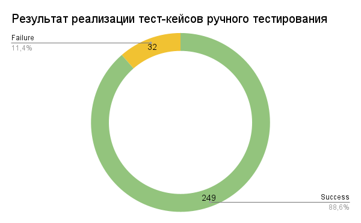

<h1>Отчет ручного тестирования</h1>

<h2>Краткое описание</h2>
В ходе тестирования были реализованы все тест-кейсы описанные в файле 
  <a href="Cases.xlsx">Cases.xlsx</a> 
  - вкладка "test cases", которые проверяют работу приложения “В Хосписе”.
Суть тестирования заключается в проверке обязательных функций приложения, отображения UI элементов, поверхностной проверке клиент-серверного взаимодействия.

<h2>Сведения о ходе испытаний</h2>
В процессе проведения тестирования был реализован 281 тест-кейс. Из них: 

  <ul>
    <li>Успешно пройденных - 249 или 88,6%.</li>
    <li>Неудачных - 32 шт или 11,4%.</li>
    <figure>
       
    </figure>
  </ul>

<h2>Результаты испытаний</h2>
Неудачные тест-кейсы описаны в файле 
  <a href="Cases.xlsx">Cases.xlsx</a> 
  - вкладка "failed test cases".
Список баг-репортов на неудачные тест-кейсы, доступных для воспроизведения, описан в файле 
  <a href="BugReportsManual.md">BugReportsManual.md</a>.
